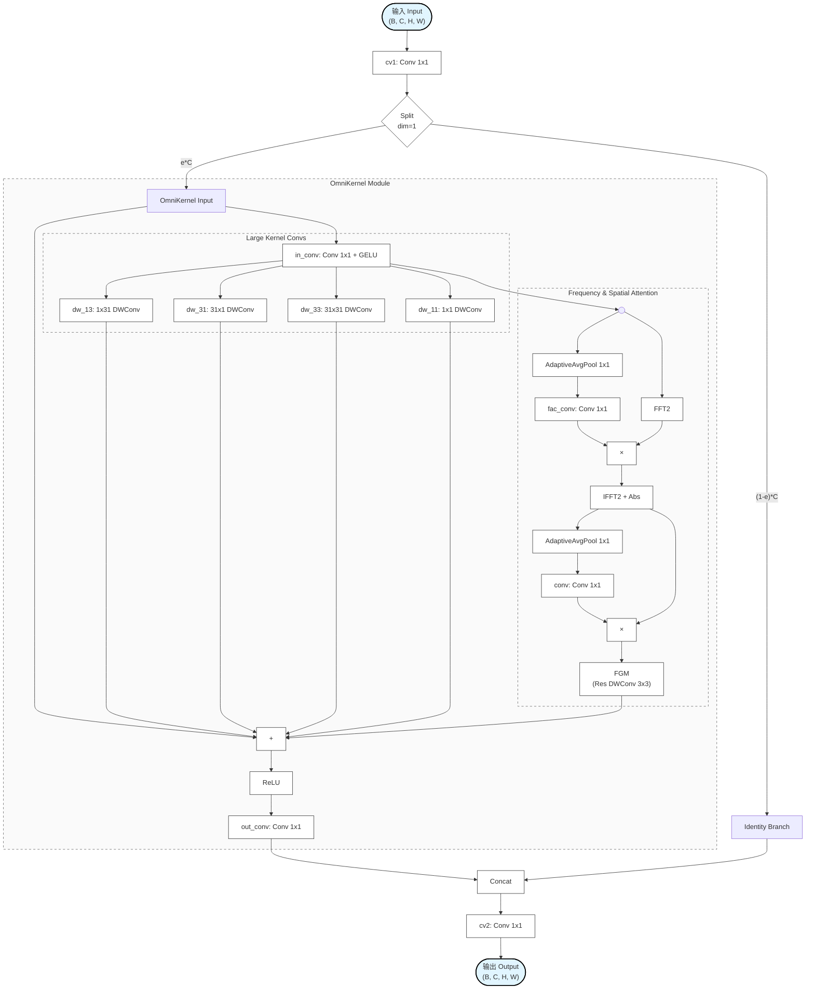
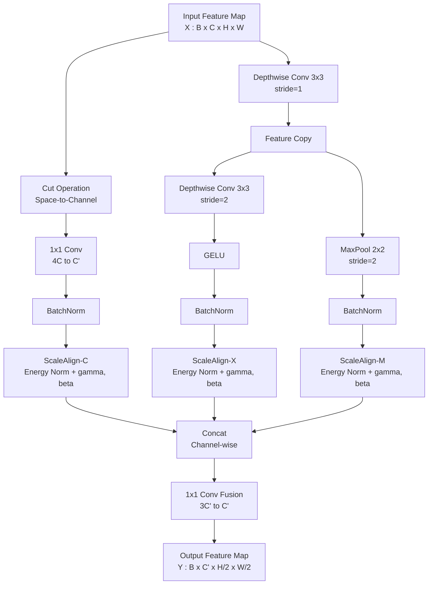

```mermaid
graph TB
    Start(["输入 x<br/>shape: B,C1,H,W"]) --> CV1["cv1: Conv<br/>C1 → 2*c<br/>1x1卷积"]
    
    CV1 --> Chunk{"chunk分割<br/>dim=1"}
    
    Chunk --> Y0["y(0)<br/>shape: B,c,H,W"]
    Chunk --> Y1["y(1)<br/>shape: B,c,H,W"]
    
    Y1 --> M1_Input["m(0) 输入"]
    
    subgraph StripCGLU_Loop["StripCGLU 模块循环 (n次)"]
        direction TB
        M1_Input --> M1_Copy["保存输入副本<br/>inp_copy"]
        
        subgraph Branch1["分支1: Strip Attention"]
            M1_Copy --> Norm1["LayerNorm1<br/>BiasFree"]
            Norm1 --> SA_Proj1["proj_1<br/>Conv2d 1x1"]
            SA_Proj1 --> SA_GELU["GELU激活"]
            SA_GELU --> SA_SGU["Strip_Block"]
            
            subgraph Strip_Block_Detail["Strip_Block 详细结构"]
                SA_SGU --> SB_Conv0["conv0<br/>5x5 DWConv<br/>padding=2"]
                SB_Conv0 --> SB_Conv1["conv_spatial1<br/>k1×k2 DWConv<br/>默认: 1×19"]
                SB_Conv1 --> SB_Conv2["conv_spatial2<br/>k2×k1 DWConv<br/>默认: 19×1"]
                SB_Conv2 --> SB_Conv3["conv1<br/>1x1 Conv"]
                SB_Conv3 --> SB_Mul["元素乘法<br/>x * attn"]
            end
            
            SA_SGU --> SA_Proj2["proj_2<br/>Conv2d 1x1"]
            SA_Proj2 --> SA_Res["残差连接<br/>+ shortcut"]
            SA_Res --> SA_Out["Attention输出"]
        end
        
        SA_Out --> LS1["layer_scale_1<br/>可学习缩放"]
        LS1 --> DP1{"drop_path<br/>是否>0?"}
        DP1 -->|是| Drop1["DropPath"]
        DP1 -->|否| Identity1["Identity"]
        Drop1 --> Add1["残差加法<br/>+ inp_copy"]
        Identity1 --> Add1
        
        Add1 --> M1_Mid["中间特征<br/>out"]
        
        subgraph Branch2["分支2: Convolutional GLU"]
            M1_Mid --> Norm2["LayerNorm2<br/>BiasFree"]
            Norm2 --> CGLU["ConvolutionalGLU<br/>门控线性单元"]
            CGLU --> CGLU_Out["CGLU输出"]
        end
        
        CGLU_Out --> LS2["layer_scale_2<br/>可学习缩放"]
        LS2 --> DP2{"drop_path<br/>是否>0?"}
        DP2 -->|是| Drop2["DropPath"]
        DP2 -->|否| Identity2["Identity"]
        Drop2 --> Add2["残差加法<br/>+ out"]
        Identity2 --> Add2
        
        Add2 --> M1_Out["m(0) 输出"]
    end
    
    M1_Out --> M2_Check{"是否有m(1)?<br/>n>1"}
    M2_Check -->|是| M2["m(1)输入<br/>继续循环"]
    M2 --> Mn["...<br/>重复n次"]
    M2_Check -->|否| Concat_Prep
    Mn --> Concat_Prep
    
    Y0 --> Concat["Concat"]
    Y1 --> Concat
    Concat_Prep["所有m输出"] --> Concat
    
    Concat --> CV2["cv2: Conv<br/>(2+n)*c → C2<br/>1x1卷积"]
    
    CV2 --> Output(["输出<br/>shape: B,C2,H,W"])
    
    style Start fill:#e1f5ff
    style Output fill:#e1f5ff
    style Chunk fill:#fff4e1
    style M2_Check fill:#fff4e1
    style DP1 fill:#fff4e1
    style DP2 fill:#fff4e1
    style Branch1 fill:#f0f8ff
    style Branch2 fill:#f0fff0
    style Strip_Block_Detail fill:#fff0f5
    style StripCGLU_Loop fill:#fafafa
```

```mermaid
graph TB
    %% 样式定义
    classDef input fill:#e1f5ff,stroke:#000,stroke-width:2px;
    classDef op fill:#fff,stroke:#333,stroke-width:1px;
    classDef cluster fill:#fafafa,stroke:#666,stroke-width:1px,stroke-dasharray: 5 5;
    classDef branch fill:#f0f8ff,stroke:#333,stroke-width:1px;

    Input(["输入 Input<br/>(B, C1, H, W)"]):::input --> CV1["cv1: Conv 1x1"]:::op
    CV1 --> Split{"Split<br/>dim=1"}:::op
    
    Split -->|"(1-e)*C"| Y0["y0 (Identity)"]
    Split -->|"e*C"| Y1["y1 (Main Branch)"]
    
    subgraph StripCGLU_Seq["StripCGLU Sequence (n times)"]
        direction TB
        Y1 --> SC_In["StripCGLU Input"]
        
        %% StripCGLU Block
        subgraph StripCGLU["StripCGLU Block"]
            direction TB
            SC_In --> Norm1["Norm1: BatchNorm2d"]:::op
            
            %% Branch 1: Strip Attention
            subgraph StripAttn["Branch 1: Strip Attention"]
                direction TB
                Norm1 --> SA_In["Input"]
                SA_In --> SA_Proj1["proj_1: Conv 1x1 + GELU"]:::op
                
                %% Strip Block
                subgraph StripBlock["Strip Block (Spatial Gating Unit)"]
                    direction TB
                    SA_Proj1 --> SB_In["Input"]
                    SB_In --> SB_Conv0["conv0: 5x5 DWConv"]:::op
                    SB_Conv0 --> SB_S1["conv_spatial1: k1xk2 DWConv"]:::op
                    SB_S1 --> SB_S2["conv_spatial2: k2xk1 DWConv"]:::op
                    SB_S2 --> SB_Conv1["conv1: Conv 1x1"]:::op
                    SB_Conv1 --> SB_Mul["×"]:::op
                    SB_In --> SB_Mul
                end
                
                SB_Mul --> SA_Proj2["proj_2: Conv 1x1"]:::op
                SA_In --> SA_Add["+"]:::op
                SA_Proj2 --> SA_Add
            end
            
            SA_Add --> LS1["Layer Scale 1"]:::op
            LS1 --> DP1["Drop Path"]:::op
            SC_In --> Add1["+"]:::op
            DP1 --> Add1
            
            %% Branch 2: Convolutional GLU
            Add1 --> Norm2["Norm2: BatchNorm2d"]:::op
            
            subgraph CGLU["Branch 2: Convolutional GLU"]
                direction TB
                Norm2 --> CGLU_In["Input"]
                CGLU_In --> FC1["fc1: Conv 1x1"]:::op
                FC1 --> Chunk{"Chunk"}:::op
                Chunk --> X["x"]
                Chunk --> V["v"]
                
                X --> DW["dwconv: 3x3 DWConv + Act"]:::op
                DW --> Mul_CGLU["×"]:::op
                V --> Mul_CGLU
                
                Mul_CGLU --> FC2["fc2: Conv 1x1"]:::op
                CGLU_In --> CGLU_Add["+"]:::op
                FC2 --> CGLU_Add
            end
            
            CGLU_Add --> LS2["Layer Scale 2"]:::op
            LS2 --> DP2["Drop Path"]:::op
            Add1 --> Add2["+"]:::op
            DP2 --> Add2
        end
        
        Add2 --> SC_Out["StripCGLU Output"]
    end
    
    Y0 --> Concat["Concat"]:::op
    SC_Out --> Concat
    
    Concat --> CV2["cv2: Conv 1x1"]:::op
    CV2 --> Output(["输出 Output<br/>(B, C2, H, W)"]):::input
```

# C2f_StripCGLU 模块结构图

## 完整数据流图

## 关键参数说明

| 参数 | 默认值 | 说明 | 影响 |
|------|--------|------|------|
| `c1` | - | 输入通道数 | 决定cv1的输入维度 |
| `c2` | - | 输出通道数 | 决定cv2的输出维度 |
| `n` | 1 | StripCGLU模块重复次数 | 决定堆叠的模块数量 |
| `e` | 0.5 | 扩展系数 | 决定隐藏层通道数 c = int(c2*e) |
| `k1` | 1 | Strip卷积核尺寸1 | 影响Strip_Block中的空间卷积形状 |
| `k2` | 19 | Strip卷积核尺寸2 | 影响Strip_Block中的空间卷积形状 |
| `drop_path` | 0 | DropPath概率 | >0时启用随机深度，否则使用Identity |
| `shortcut` | False | C2f基类参数 | 本模块中被重写未使用 |
| `g` | 1 | C2f基类参数 | 本模块中被重写未使用 |

## 数据流关键点

1. **输入分割**: 通过 `cv1` 将输入从 C1 扩展到 2c 通道，然后分割为两部分
2. **级联处理**: y(0) 直接传递，y(1) 经过 n 个 StripCGLU 模块处理
3. **StripCGLU 双分支**:
   - **分支1**: Strip Attention - 使用条带状卷积捕获长距离依赖
   - **分支2**: Convolutional GLU - 门控线性单元增强特征
4. **残差连接**: 每个分支都有残差连接和可学习的层缩放
5. **最终融合**: 将所有特征（y(0), y(1), m(0)...m(n-1)）拼接后通过 cv2 输出

## Strip_Block 特性

- 使用 **1×19** 和 **19×1** 的非对称卷积核捕获水平和垂直方向的长距离特征
- 深度可分离卷积（groups=dim）降低计算量
- 最终通过元素乘法实现注意力机制

# CSPOmniKernel 模块结构图

## 完整数据流图

## 关键参数说明

| 参数 | 默认值 | 说明 |
|------|--------|------|
| `dim` | - | 输入/输出通道数 |
| `e` | 0.25 | 扩展比率，决定OmniKernel分支的通道数占比 |
| `ker` | 31 | OmniKernel中的大卷积核尺寸 |

## 模块特性分析

1. **CSP结构**: 采用Cross Stage Partial结构，将特征分为两部分，一部分经过复杂的OmniKernel处理，另一部分直接保留，最后融合。这有助于减少计算量并丰富梯度组合。
2. **OmniKernel**:
   - **多尺度大核卷积**: 并行使用 $1\times 31$, $31\times 1$, $31\times 31$, $1\times 1$ 的深度可分离卷积，捕获不同尺度的空间特征。
   - **频域与空域注意力**: 结合了频域通道注意力 (FCA) 和空域通道注意力 (SCA)，利用FFT/IFFT在频域进行全局信息交互。
   - **FGM**: 特征门控模块，进一步增强特征表达。
3. **残差连接**: OmniKernel内部包含从输入直接到求和点的残差连接，保证了梯度的有效传播。

# C2f-StripCGLU 完整模型结构图 (详细版)

## 完整数据流图

## 关键参数说明

| 参数 | 默认值 | 说明 |
|------|--------|------|
| `c1`, `c2` | - | 输入/输出通道数 |
| `n` | 1 | StripCGLU 模块的堆叠次数 |
| `e` | 0.5 | 扩展比率，决定隐藏层通道数 |
| `k1`, `k2` | 1, 19 | Strip Attention 中的条带卷积核尺寸 |

## 模块特性分析

1.  **双分支结构**: StripCGLU 结合了 Strip Attention (用于长距离依赖) 和 Convolutional GLU (用于局部特征和通道混合)。
2.  **Strip Attention**: 使用非对称卷积核 ($1\times k2$, $k2\times 1$) 有效捕获条带状特征，适合行人检测等任务。
3.  **Convolutional GLU**: 引入门控机制，增强了非线性表达能力。
4.  **Layer Scale & Drop Path**: 引入了层缩放和随机深度，有助于训练深层网络。

# DRFD

